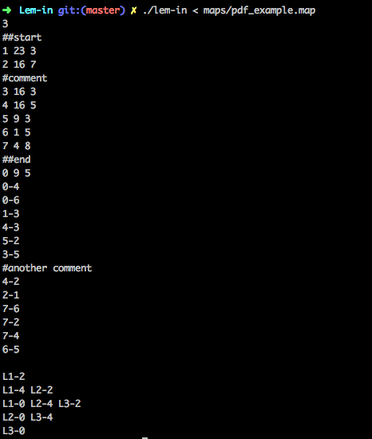
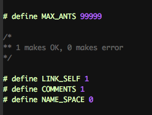
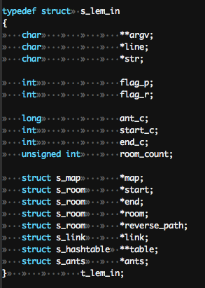
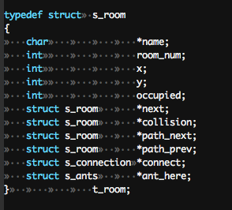

# Lem-in

#### Final Score 125/100

## Challenge

Find the shortest path to get **n** ants across a colony (comprised of rooms and tunnels). <br />
<br />

At the beginning of the game, all the ants are in the room **##start**. 
The goal is to bring them to the room **##end** with as few moves as possible. <br />

Each room can only contain one ant at a time (except at **##start** and **##end** which can contain as many ants as necessary). <br />

The shortest path isn't necessarily the simplest. <br />
Some maps will have many rooms and many links, but no path between **start** and **end**. <br />
Some maps will have rooms that link to themselves, sending your path-search spinning in circles. <br />
Some maps will have too many/too few ants, no start or end, duplicate rooms, links to unknown rooms, <br />
rooms with invalid coordinates, and a variety of other invalid or poorly-formatted input. <br />
Ants will also need to avoid traffic jams (walking all over their fellow ants). <br />

## The Project

Create the program ```lem-in```. <br />
```lem-in``` will read the map (describing the ants and the colony) from the ```sdtin```. 

Upon successfully finding the shortest path, ```lem-in``` will display the parsed input, and each ant's move <br />
from room to room. <br />


<br />

The program must handle errors carefully, or your program risks crashing violently. In no way can it quit <br />
in an unexpected manner (segmentation fault, bus error, double free, etc). It must not have any memory leaks. <br />

**Lem-in** must conform to the [42 Norm](https://cdn.intra.42.fr/pdf/pdf/960/norme.en.pdf). Using normal ```libc``` functions is strictly forbidden. <br /> 
Students are however, allowed to use: ```write```, ```read```, ```malloc```, ```free```, ```exit```. <br /> 
<br /> 

## Approach

The subject for ```lem-in``` is deliberately vague (like most projects at 42), so some error handling comes down to <br />
design choice.

The following macros can be modified in the ```lem_in.h``` header file:

- ```MAX_ANTS```: Ants are malloc'ed as structs, and having too many ants can slow the program down and cause <br />
poor performance.
- ```COMMENTS```: Input is broken by comments, which start with #. A comment that looks like: ```###comment##``` can be <br />
considered valid or invalid input, depending on the individual's interpretation of the subject. <br />
- ```LINK-SELF```: Rooms that link to back onto themselves may send your path-search spinning in circles, <br />
and can also be considered valid or invalid input. <br />
- ```NAME_SPACE```: A room is defined by ```name coord_x coord_y```, and will usually look like: ```Room 1 2``` <br />
(so a string, separated by 2 spaces). But what if a room name has a space inside it? Turning on this macro allows <br />
rooms to be formatted as ```Big Room 1 2```, ```Big Beautiful Room 1 2```, etc. <br />


<br />

Once you have overcome the intial challenge of parsing the input, how do you store all that information? And how do you <br />
find a path in a map that has 10,000 rooms?

I store all parsed data in structs. The ants, rooms, and links are each stored in linked lists. <br />


<br />

The rooms also contain connection and path next/prev structs, which are also stored in linked lists. <br />


<br />

Unfortunately, accessing an individual room among 10,000 by iterating through a linked list is a pain, and can slow down 
<br />
your program considerably. I therefore **impemented a hashtable** for more efficient room storage, which means 
I can almost instaneously jump from ```Room 1``` to ```Room 9999```, if they are connected. 
Collisions are accounted for, and are stored adjacently to each other. <br />

**My path-solving algorithm functions recursively**, going down every possible path simultaneously until it has reached 
the end room, at which point it starts retracing its path back to the start. The first solution it finds therefore _must_ 
be the shortest path, as any longer paths would keep the recursive search going. <br />
Since all possible paths are pursued simultaneously, rooms that link back to themselves are not a problem. <br />
If no path is found, an error message is displayed and the program exits. 

## Usage
Run ```make```.
``` c
$>./lem-in < maps/test1.map
```


Credit for most of the maps in ./maps goes to: @davhojt & emilwallner.
